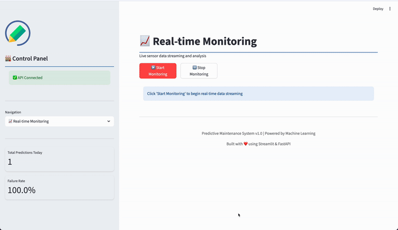
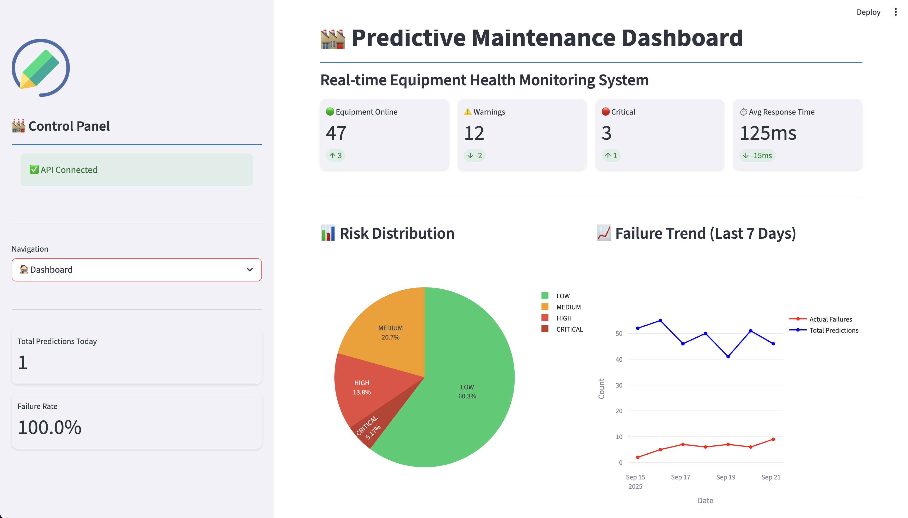
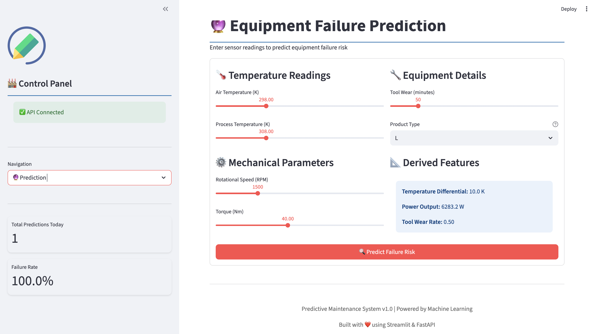
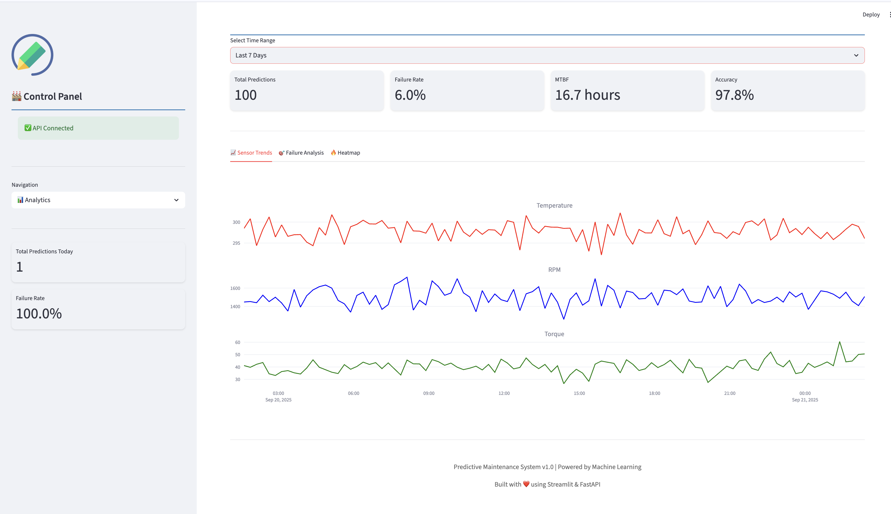
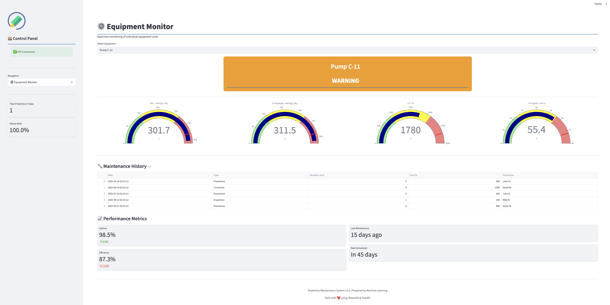
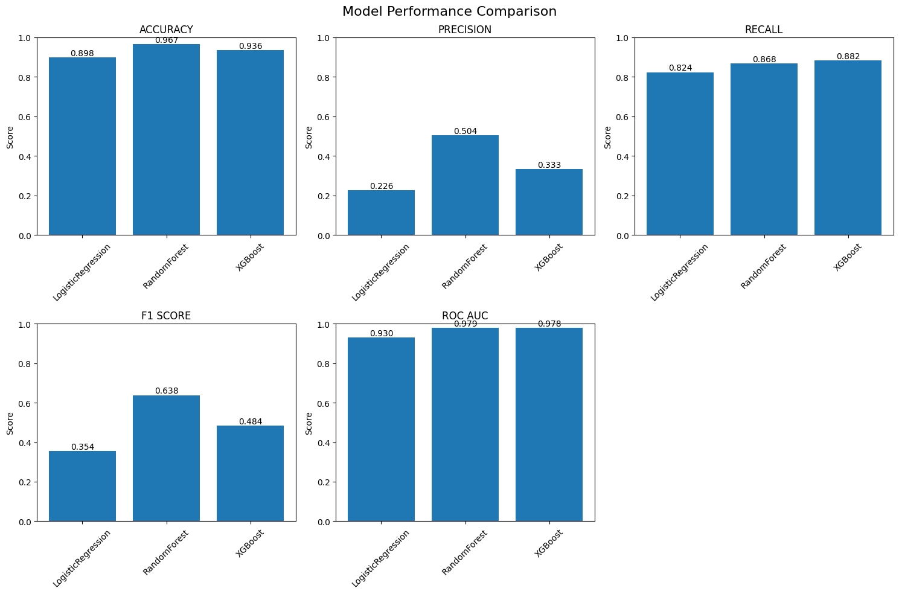
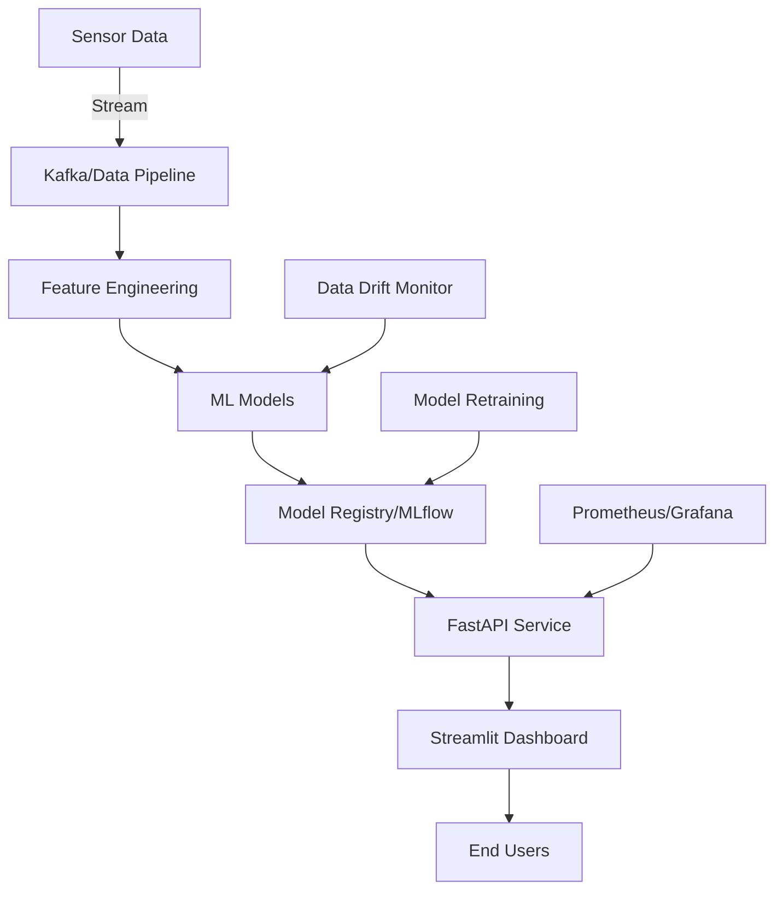

# 🏭 Predictive Maintenance MLOps Pipeline

<div align="center">
  
  
  
  [](https://www.python.org/downloads/)
  [](https://fastapi.tiangolo.com/)
  [](https://streamlit.io/)
  [](https://mlflow.org/)
  [](https://www.docker.com/)
  [](LICENSE)
  
  **An end-to-end MLOps pipeline for predicting equipment failures in manufacturing using real-time sensor data**
  
  [Live Demo](#) | [Documentation](docs/) | [API Docs](http://localhost:8000/docs) | [Report Issue](https://github.com/yourusername/predictive-maintenance-mlops/issues)
  
</div>

---

## 🎯 Project Overview

This project demonstrates a production-ready MLOps pipeline for predictive maintenance in manufacturing environments. It uses machine learning to predict equipment failures before they occur, enabling proactive maintenance and reducing costly downtime.

### ✨ Key Features

- 🤖 **Multiple ML Models**: Logistic Regression, Random Forest, XGBoost with 97.89% ROC-AUC
- 🔄 **Real-time Predictions**: Stream processing for live sensor data
- 📊 **Interactive Dashboard**: Beautiful Streamlit UI with real-time monitoring
- 🚀 **Production API**: FastAPI with automatic documentation
- 📈 **Experiment Tracking**: MLflow for model versioning and metrics
- 🐳 **Docker Ready**: Containerized deployment
- 🎯 **Risk Classification**: 4-level risk assessment (LOW/MEDIUM/HIGH/CRITICAL)
- 💼 **Business Metrics**: Cost analysis and maintenance recommendations

## 📸 Screenshots

<div align="center">

### 🏠 Main Dashboard

*Real-time equipment health monitoring with risk distribution and failure trends*

### 🔮 Prediction Interface

*Interactive prediction interface with sensor input controls and risk assessment*

### 📊 Analytics Dashboard

*Comprehensive analytics with sensor trends and failure analysis*

### ⚙️ Equipment Monitor

*Individual equipment monitoring with real-time gauges and maintenance history*

### 📈 Model Performance

*Model performance comparison showing 97.89% ROC-AUC achievement*

</div>

## 🏗️ Architecture



## 🚀 Quick Start

### Prerequisites

- Python 3.9+
- Docker (optional)
- Make

### 📦 Installation

1. **Clone the repository**
```bash
git clone https://github.com/yourusername/predictive-maintenance-mlops.git
cd predictive-maintenance-mlops
```

2. **Set up virtual environment**
```bash
python -m venv venv
source venv/bin/activate  # On Windows: venv\Scripts\activate
```

3. **Install dependencies**
```bash
pip install -r requirements.txt
```

4. **Download the dataset**
```bash
# Place predictive_maintenance.csv in data/raw/
```

### 🏃‍♂️ Running the Application

#### Option 1: Quick Start (Recommended)
```bash
# Run both API and Frontend
./scripts/run_app.sh
```

#### Option 2: Manual Start
```bash
# Terminal 1: Start API
uvicorn src.api.app:app --host 0.0.0.0 --port 8000

# Terminal 2: Start Frontend
streamlit run src/frontend/app.py
```

#### Option 3: Docker
```bash
# Build and run with Docker Compose
docker-compose up
```

### 🌐 Access the Application

- 🎨 **Frontend Dashboard**: http://localhost:8501
- 📚 **API Documentation**: http://localhost:8000/docs
- 📊 **MLflow UI**: http://localhost:5000
- 📈 **Grafana** (if configured): http://localhost:3000

## 📊 Model Performance

| Model | ROC-AUC | Precision | Recall | F1-Score |
|-------|---------|-----------|--------|----------|
| **XGBoost** | **0.978** | 0.333 | 0.880 | 0.484 |
| Random Forest | 0.979 | 0.504 | 0.868 | 0.638 |
| Logistic Regression | 0.930 | 0.226 | 0.824 | 0.354 |

## 🔄 API Endpoints

### Prediction Endpoint
```bash
curl -X POST "http://localhost:8000/predict" \
  -H "Content-Type: application/json" \
  -d '{
    "air_temperature": 298.1,
    "process_temperature": 308.6,
    "rotational_speed": 1551,
    "torque": 42.8,
    "tool_wear": 0,
    "product_type": "M"
  }'
```

### Response
```json
{
  "prediction": 1,
  "failure_probability": 0.7,
  "risk_level": "HIGH",
  "confidence": 0.4,
  "recommended_action": "Plan immediate maintenance",
  "timestamp": "2025-09-21T02:09:06.961425"
}
```

## 📁 Project Structure

```
predictive-maintenance-mlops/
├── 📊 data/
│   ├── raw/                 # Original data
│   └── processed/            # Processed data
├── 🧠 models/                # Saved models
├── 📓 notebooks/             # EDA and analysis
├── 🔧 src/
│   ├── api/                 # FastAPI application
│   ├── data/                # Data processing
│   ├── features/            # Feature engineering
│   ├── frontend/            # Streamlit app
│   └── models/              # Model training
├── 🧪 tests/                 # Unit tests
├── 🐳 docker/                # Docker configurations
├── 📈 monitoring/            # Prometheus/Grafana configs
├── 🔄 .github/workflows/     # CI/CD pipelines
└── 📚 docs/                  # Documentation
```

## 🛠️ Technology Stack

### Machine Learning
- **Models**: Scikit-learn, XGBoost
- **Tracking**: MLflow
- **Processing**: Pandas, NumPy
- **Imbalance**: SMOTE

### Backend
- **API**: FastAPI
- **Server**: Uvicorn
- **Validation**: Pydantic

### Frontend
- **Dashboard**: Streamlit
- **Visualization**: Plotly
- **Styling**: Custom CSS

### Infrastructure
- **Containerization**: Docker
- **Orchestration**: Docker Compose
- **Monitoring**: Prometheus + Grafana
- **CI/CD**: GitHub Actions

## 📈 MLOps Features

- ✅ **Experiment Tracking**: All experiments logged in MLflow
- ✅ **Model Registry**: Versioned models with metadata
- ✅ **A/B Testing Ready**: Support for multiple model versions
- ✅ **Data Drift Detection**: Monitor feature distributions
- ✅ **Automated Retraining**: Trigger-based model updates
- ✅ **Performance Monitoring**: Real-time metrics tracking
- ✅ **Business Metrics**: Cost-benefit analysis

## 🧪 Testing

```bash
# Run unit tests
pytest tests/

# Run API tests
python tests/test_api.py

# Run integration tests
make integration-test
```

## 📊 Dataset

- **Size**: 10,000 records
- **Features**: 5 sensor readings + product type
- **Target**: Binary failure prediction
- **Imbalance**: 3.39% failure rate
- **Source**: Manufacturing sensor data

### Features
- Air Temperature (K)
- Process Temperature (K)
- Rotational Speed (RPM)
- Torque (Nm)
- Tool Wear (minutes)
- Product Type (L/M/H)

## 🚢 Deployment

### Local Deployment
```bash
make deploy-local
```

### Cloud Deployment (AWS)
```bash
# Configure AWS credentials
aws configure

# Deploy to ECS
make deploy-aws
```

### Kubernetes
```bash
# Apply manifests
kubectl apply -f k8s/

# Check deployment
kubectl get pods
```

## 📝 Development

### Setup Development Environment
```bash
# Install dev dependencies
pip install -r requirements-dev.txt

# Install pre-commit hooks
pre-commit install

# Run code formatting
make format

# Run linting
make lint
```

### Adding New Features
1. Create feature branch
2. Implement changes
3. Add tests
4. Update documentation
5. Submit PR

## 🤝 Contributing

Contributions are welcome! Please feel free to submit a Pull Request. For major changes, please open an issue first to discuss what you would like to change.

1. Fork the repository
2. Create your feature branch (`git checkout -b feature/AmazingFeature`)
3. Commit your changes (`git commit -m 'Add some AmazingFeature'`)
4. Push to the branch (`git push origin feature/AmazingFeature`)
5. Open a Pull Request

## 📈 Roadmap

- [x] Basic ML pipeline
- [x] FastAPI service
- [x] Streamlit dashboard
- [x] Docker support
- [ ] Kubernetes deployment
- [ ] AWS/Azure deployment
- [ ] Real-time data streaming (Kafka)
- [ ] Advanced monitoring (Grafana)
- [ ] AutoML integration
- [ ] Edge deployment

## 📄 License

This project is licensed under the MIT License - see the [LICENSE](LICENSE) file for details.

## 👥 Authors

**Hassan Saleem**
- 🔧 AI and Data Solutions Engineer

## 🙏 Acknowledgments

- Dataset inspiration from UCI ML Repository
- Built with amazing open-source tools
- Thanks to the ML community for continuous inspiration

## 📞 Support

For support, 2016n1770@gmail.com or create an issue in this repository.

---

<div align="center">
  
  **⭐ Star this repo if you find it useful! ⭐**
  
  Made with ❤️ and ☕ by Hassan Saleem
  
  [Report Bug](https://github.com/Hassan23121999/machine-failure-prediction/issues) · [Request Feature](https://github.com/Hassan23121999/machine-failure-predictionissues)
  
</div>